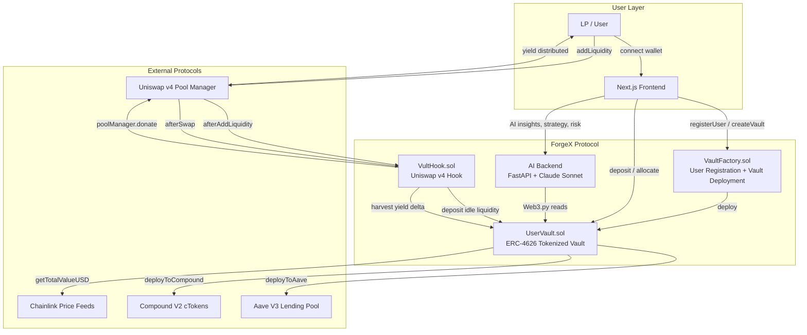
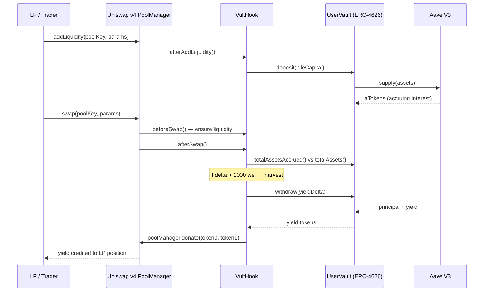

# ForgeX: Vult

<div align="center">


[](https://github.com/BitBand-Labs/forgeX)
[](https://basescan.org)
[](https://github.com/Uniswap/v4-core)
[](https://anthropic.com)
[](https://eips.ethereum.org/EIPS/eip-4626)
[](LICENSE)

**[Demo Video](YOUR_DEMO_VIDEO_LINK_HERE) · [Pitch Deck](YOUR_PITCH_DECK_LINK_HERE) · [Live App](YOUR_VERCEL_URL_HERE) · [GitHub](https://github.com/BitBand-Labs/forgeX)**

</div>

---

> **The Problem:** Liquidity providers in Uniswap v4 only earn swap fees. The billions of dollars sitting idle in AMM pools earn zero yield between trades — a massive capital inefficiency.
>
> **The Solution:** ForgeX:Vult is a **yield-native DeFi protocol** that automatically routes idle LP liquidity through ERC-4626 vaults (depositing to Aave and Compound), then harvests the accrued interest and **donates it directly back to LPs via `poolManager.donate()`**. LPs earn swap fees **and** lending yield — simultaneously, automatically, without lifting a finger.

---

## Architecture



---

## Yield Harvesting Flow



---

## Deployed Contracts — Base Mainnet

| Contract | Address | Explorer |
|----------|---------|----------|
| **VaultFactory** | `0x8374257da04F00ABAf74E13EFE5A17B0f08EC226` | [View on BaseScan](https://basescan.org/address/0x8374257da04F00ABAf74E13EFE5A17B0f08EC226) |
| **VultHook** | `0xe988b6816d94C10377779F08f2ab08925cE96D09` | [View on BaseScan](https://basescan.org/address/0xe988b6816d94C10377779F08f2ab08925cE96D09) |
| **Base PoolManager** | `0x498581Ff718922c3f8e6A2444956aF099B2652b2` | [View on BaseScan](https://basescan.org/address/0x498581Ff718922c3f8e6A2444956aF099B2652b2) |

---

## Project Structure

```
forgeX/
├── smartcontract/              # Solidity smart contracts (Hardhat + Foundry)
│   ├── contracts/
│   │   ├── VaultFactory.sol         # User registration + vault deployment factory
│   │   ├── UserVault.sol            # ERC-4626 vault with Aave + Compound integration
│   │   ├── vult/VultHook.sol        # Uniswap v4 hook — the core innovation
│   │   └── interfaces/              # Aave, Compound, ERC-4626, IUserVault
│   ├── test/                        # Hardhat (TypeScript) + Foundry (Solidity) tests
│   └── README.md                    # Smart contract deep-dive
│
├── frontend/                   # Next.js 16.1.1 — App Router, TypeScript
│   ├── app/                         # 8 routes: /, /dashboard, /vaults, /analytics,
│   │   │                            #           /portfolio, /compare, /history, /hook
│   ├── components/                  # 11 React components
│   ├── hooks/                       # wagmi-based on-chain hooks
│   ├── lib/                         # ABIs, constants, AI client
│   └── README.md                    # Frontend deep-dive
│
└── ai-backend/                 # Python FastAPI + Anthropic Claude
    ├── main.py                      # 7 REST endpoints
    ├── ai_engine.py                 # Claude Sonnet integration
    ├── chain.py                     # On-chain reads via Web3.py
    └── README.md
```

---

## How It Works

### 1 — User Vaults (Personal Yield)

Users register on-chain and deploy personal `UserVault` instances — ERC-4626 tokenized vaults that track their deposits with share accounting. Once deposited, users can allocate capital to **Aave V3** or **Compound V2** to earn lending yield. Chainlink price feeds provide real-time USD valuations. All yield accrues inside the vault and is reflected in the rising share price.

### 2 — VultHook (LP Yield Amplification)

VultHook is a Uniswap v4 hook that intercepts pool lifecycle events:

- **`afterAddLiquidity`** — when LPs provide liquidity, idle capital is deposited into ForgeX vaults (deployed to Aave/Compound). Capital goes to work immediately.
- **`beforeSwap`** — ensures the pool has enough liquid capital to execute the swap; rebalances from vaults if needed.
- **`afterSwap`** — compares `totalAssetsAccrued()` vs `totalAssets()`. If the delta exceeds 1,000 wei, the accrued yield is harvested and donated to LPs via `poolManager.donate()`.

**Result:** LPs earn standard Uniswap swap fees **plus** the lending yield their idle capital generates between swaps.

### 3 — AI Strategy Engine

The FastAPI backend reads on-chain data (vault balances, allocations, yield) via Web3.py and passes it to Claude Sonnet to generate:
- **Insights** — what's happening across your vaults right now
- **Strategy** — personalised allocation advice (conservative / balanced / aggressive)
- **Risk** — risk score 1–10 with breakdown
- **Chat** — conversational assistant for DeFi questions

---

## Tech Stack

| Layer | Technology | Purpose |
|-------|-----------|---------|
| Smart Contracts | Solidity ^0.8.24, Hardhat, Foundry | ERC-4626 vaults + Uniswap v4 hook |
| Standards | ERC-4626, ERC-20, [Uniswap v4 IHooks](https://github.com/Uniswap/v4-core) | Tokenized vaults + hook interface |
| DeFi Integrations | Aave V3, Compound V2, Chainlink | Yield sources + USD price feeds |
| Frontend | Next.js 16.1.1, React 19, TypeScript | App Router, SSR |
| Styling | Tailwind CSS v4 | Olive green design system |
| Web3 | Wagmi v3, Viem v2, Reown AppKit | Wallet + on-chain hooks |
| Animations | Framer Motion | Page transitions, card reveals |
| AI Backend | FastAPI, Python 3.11 | REST API layer |
| AI Model | Anthropic Claude Sonnet 4 | Strategy, insights, risk, chat |
| On-chain Reads | Web3.py | AI backend reads vault state |
| Network | Base Mainnet (Chain ID 8453) | L2 deployment |
| Frontend Deploy | Vercel | CI/CD, edge network |
| Backend Deploy | Render | `https://forgex-14vp.onrender.com` |

---

## Features

### Smart Contracts
- Multi-vault creation per user (unlimited vaults, each independently managed)
- On-chain user registration: username, bio, member-since timestamp
- ERC-4626 compliant: deposit / withdraw / mint / redeem with share price accounting
- Aave V3 and Compound V2 allocation with single-function calls
- Chainlink price feeds for manipulation-resistant USD valuations
- VultHook: `afterAddLiquidity` → idle LP capital deployed; `afterSwap` → yield harvested → `donate()` to LPs
- Chainlink Automation compatible: `checkUpkeep` / `performUpkeep` for automated yield harvesting
- Pause / unpause emergency controls + `transferOwnership` governance

### Frontend (8 Pages)
- **`/`** — Landing: hero, protocol stats, feature cards, wallet connect + registration
- **`/dashboard`** — Vault grid, AI insights panel (Insights / Strategy / Risk tabs), user profile card
- **`/vaults`** — Full vault management: Deposit, Withdraw, Allocate (Aave + Compound), Share tokens, Admin (owner only)
- **`/analytics`** — Per-vault yield %, USD value, share price, Aave / Compound / Idle allocation bar
- **`/portfolio`** — Aggregated view: total USD, combined yield %, portfolio-wide allocation bar, per-vault breakdown table
- **`/compare`** — Side-by-side vault comparison: all metrics across all vaults in a scrollable grid
- **`/history`** — On-chain Deposit / Withdraw event log via `getLogs`, linked to BaseScan tx hashes
- **`/automation`** — Chainlink Automation status per vault (`checkUpkeep`), 5-step registration guide

### AI Backend (7 Endpoints)
- `GET  /api/portfolio/{address}` — live on-chain portfolio data
- `POST /api/insights` — bullet-point dashboard insights
- `POST /api/strategy` — yield strategy advice by risk profile
- `POST /api/risk` — risk score 1–10 with factor breakdown
- `POST /api/chat` — conversational assistant with message history
- `GET  /api/platform-stats` — protocol-wide statistics
- `GET  /health` — health check

---

## Design System

ForgeX uses an **olive green** theme engineered for dark DeFi UX:

| Token | Dark | Light | Usage |
|-------|------|-------|-------|
| `--primary` | `#8FA828` | `#6D8020` | CTAs, active states, badges |
| `--background` | `#090A06` | `#F5F4EE` | Page background |
| `--card` | `#181B0C` | `#E8E5D8` | Elevated surfaces |
| `--foreground` | `#E8E2CF` | `#1A1C10` | Body text |
| `--foreground-muted` | `#918E78` | `#5C5940` | Labels, secondary text |

Full light mode toggled via `ThemeToggle` in the navbar, persisted to `localStorage`.

---

## Quick Start

```bash
# Clone the repository
git clone https://github.com/BitBand-Labs/forgeX.git
cd forgeX

# ── Smart Contracts ─────────────────────────────────────────────────────────
cd smartcontract
npm install
npx hardhat compile
npx hardhat test
# Foundry (optional dual test runner)
forge install && forge test

# ── Frontend ─────────────────────────────────────────────────────────────────
cd ../frontend
npm install
cp .env.example .env.local
# Fill in NEXT_PUBLIC_REOWN_PROJECT_ID and NEXT_PUBLIC_AI_BACKEND_URL
npm run dev          # → http://localhost:3000

# ── AI Backend ───────────────────────────────────────────────────────────────
cd ../ai-backend
python -m venv venv && source venv/bin/activate
pip install -r requirements.txt
cp .env.example .env   # Fill in ANTHROPIC_API_KEY, BASE_RPC_URL, VAULT_FACTORY_ADDRESS
uvicorn main:app --reload   # → http://localhost:8000
```

---

## Environment Variables

### Frontend — `frontend/.env.local`
```env
# Required — get a project ID at https://cloud.reown.com
NEXT_PUBLIC_REOWN_PROJECT_ID=your_reown_project_id

# AI Backend (deployed on Render, or localhost for dev)
NEXT_PUBLIC_AI_BACKEND_URL=https://forgex-14vp.onrender.com
```

### Smart Contracts — `smartcontract/.env`
```env
PRIVATE_KEY=your_deployer_private_key
BASE_RPC_URL=https://mainnet.base.org
BASE_SEPOLIA_RPC_URL=https://sepolia.base.org
ETHERSCAN_API_KEY=your_basescan_api_key
```

### AI Backend — `ai-backend/.env`
```env
ANTHROPIC_API_KEY=sk-ant-...
BASE_RPC_URL=https://mainnet.base.org
VAULT_FACTORY_ADDRESS=0x8374257da04F00ABAf74E13EFE5A17B0f08EC226
```

---

## Key Links

| Resource | URL |
|---------|-----|
| Live App | [YOUR_VERCEL_URL_HERE] |
| Demo Video | [YOUR_DEMO_VIDEO_LINK_HERE] |
| Pitch Deck | [YOUR_PITCH_DECK_LINK_HERE] |
| AI Backend | https://forgex-14vp.onrender.com |
| GitHub | https://github.com/BitBand-Labs/forgeX |
| VaultFactory (BaseScan) | https://basescan.org/address/0x8374257da04F00ABAf74E13EFE5A17B0f08EC226 |
| VultHook (BaseScan) | https://basescan.org/address/0xe988b6816d94C10377779F08f2ab08925cE96D09 |
| Uniswap v4-core | https://github.com/Uniswap/v4-core |
| Uniswap v4 Hook Docs | https://docs.uniswap.org/contracts/v4/overview |

---

## Network

| Network | Chain ID | RPC | Explorer |
|---------|----------|-----|----------|
| Base Mainnet | 8453 | `https://mainnet.base.org` | [basescan.org](https://basescan.org) |
| Base Sepolia | 84532 | `https://sepolia.base.org` | [sepolia.basescan.org](https://sepolia.basescan.org) |

---

## Security Notice

> **Unaudited Contracts** — ForgeX smart contracts are deployed to Base Mainnet but have **not** undergone a formal third-party security audit. Use at your own risk. Built on audited base contracts: OpenZeppelin v5 (Ownable, ReentrancyGuard, Pausable) and Uniswap v4-core.

---

## License

MIT License — see [LICENSE](LICENSE) for details.
