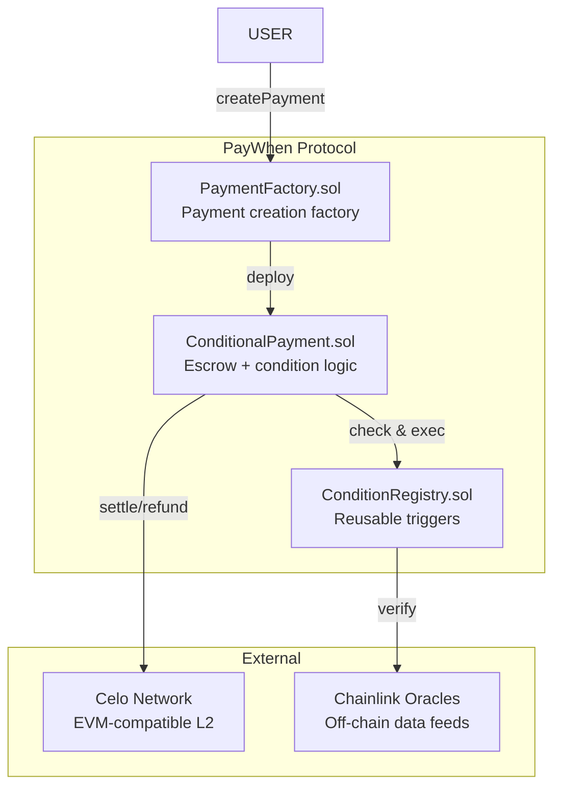

# PayWhen — Smart Contracts

<div align="center">


[](https://hardhat.org)
[](https://celo.org)
[](https://github.com/BitBand-Labs/paywhen)
[](LICENSE)

Solidity smart contracts for the PayWhen intent-based payment protocol. Conditional escrow payments with time-based, manual, and oracle-triggered execution.

---

## 🏗️ Architecture



---

## 📄 Contract Overview

### PaymentFactory.sol

Factory contract for creating conditional payment instances. Maintains registry of all active payments.

**Key Functions:**

```solidity
function createPayment(
    address _recipient,
    uint256 _amount,
    ConditionType _conditionType,
    bytes calldata _conditionData
) external payable returns (address paymentAddress);
```

**Parameters:**
- `_recipient` — Address to receive funds when condition is met
- `_amount` — Payment amount in wei (must match msg.value)
- `_conditionType` — enum { TIMESTAMP, MANUAL, ORACLE, RECURRING }
- `_conditionData` — ABI-encoded condition parameters

**Events:**
```solidity
event PaymentCreated(
    address indexed paymentAddress,
    address indexed sender,
    address indexed recipient,
    uint256 amount,
    ConditionType conditionType,
    uint256 executeAt
);
```

---

### ConditionalPayment.sol

Individual escrow contract that holds funds and enforces execution conditions. Each payment gets its own instance for isolation and transparency.

**State Variables:**
```solidity
address public sender;          // Payment creator
address public recipient;       // Payment receiver  
uint256 public amount;          // Total amount in escrow
uint256 public createdAt;       // Creation timestamp
ConditionType public conditionType;
bool public executed;           // Has payment been executed?
bool public refunded;           // Has refund been issued?
```

**Core Functions:**

| Function | Visibility | Description |
|----------|-----------|-------------|
| `execute()` | external | Execute payment if condition is met |
| `refund()` | external | Refund sender if condition fails/timeout |
| `checkCondition()` | view | Returns true if payment can execute |
| `getStatus()` | view | Returns current payment state |

**Condition Types:**

1. **TIMESTAMP** — Execute at or after specific timestamp
   ```solidity
   struct TimestampCondition {
       uint256 executeAt;  // Unix timestamp
   }
   ```

2. **MANUAL** — Execute upon recipient/creator confirmation
   ```solidity
   struct ManualCondition {
       address[] approvers;  // Addresses that must approve
       uint256 requiredApprovals;
   }
   ```

3. **RECURRING** — Execute on interval (weekly/monthly)
   ```solidity
   struct RecurringCondition {
       uint256 startTime;
       uint256 interval;    // Seconds between executions
       uint256 occurrences; // 0 = infinite
   }
   ```

4. **ORACLE** — Execute based on off-chain data (Phase 2)
   ```solidity
   struct OracleCondition {
       address oracleAddress;
       bytes32 dataFeedId;
       uint256 threshold;
       Comparison comparison;  // GT, LT, EQ
   }
   ```

**Execution Logic:**
```solidity
function execute() external {
    require(!executed, "Already executed");
    require(!refunded, "Already refunded");
    require(checkCondition(), "Condition not met");
    
    executed = true;
    payable(recipient).transfer(amount);
    
    emit PaymentExecuted(paymentAddress, recipient, amount);
}
```

**Refund Logic:**
```solidity
function refund() external {
    require(!executed, "Already executed");
    require(!refunded, "Already refunded");
    require(
        block.timestamp > createdAt + REFUND_TIMEOUT || 
        msg.sender == sender,
        "Refund not available"
    );
    
    refunded = true;
    payable(sender).transfer(amount);
    
    emit PaymentRefunded(paymentAddress, sender, amount);
}
```

---

### ConditionRegistry.sol (Optional)

Registry of standardized, reusable condition templates.

**Functions:**
```solidity
function registerTemplate(
    string memory name,
    ConditionType cType,
    bytes memory defaultData
) external;

function getTemplate(
    string memory name
) external view returns (ConditionType, bytes memory);
```

**Use Cases:**
- "WeeklyFriday" — Recurring every Friday at 9AM
- "DeliveryConfirmed" — Manual approval by courier
- "MilestoneReached" — Oracle-based on project management API

---

## 🔒 Security Features

### Reentrancy Protection
- All external calls use CEI pattern
- ReentrancyGuard on state-changing functions
- Pull-over-push for withdrawals

### Input Validation
- Zero-address checks on all user inputs
- Amount > 0 validation
- Timestamp sanity checks (not too far in future)

### Access Control
- `onlySender` modifier for sensitive operations
- Creator can only refund, not execute
- Recipient can only execute, not refund

### Edge Cases
- Timeout-based automatic refunds (30 days default)
- Grace period for manual approvals
- Failed execution doesn't lock funds

---

## 🧪 Testing

```bash
# Run all tests
npx hardhat test

# Test specific contract
npx hardhat test test/PaymentFactory.test.ts

# Gas report
REPORT_GAS=true npx hardhat test

# Coverage report
npx hardhat coverage
```

**Test Coverage:**
- Payment creation with all condition types
- Successful execution
- Refund scenarios
- Edge cases and reverts
- Access control
- Event emissions

---

## 🚀 Deployment

### Celo Alfajores (Testnet)

```bash
npx hardhat run scripts/deploy.js --network alfajores
```

### Local Development

```bash
# Start local node
npx hardhat node

# Deploy to localhost
npx hardhat run scripts/deploy.js --network localhost
```

---

## 📊 Gas Optimization

| Optimization | Savings |
|-------------|---------|
| Immutable for immutable vars | ~200 gas per access |
| Packed structs | ~20k gas on deployment |
| Custom errors over require strings | ~50 gas per revert |
| calldata over memory | ~100 gas per call |
| Unchecked math where safe | ~30 gas per operation |

---

## 🔗 Resources

- [Solidity Docs](https://docs.soliditylang.org)
- [Hardhat](https://hardhat.org)
- [Celo Developer Docs](https://docs.celo.org)
- [ERC Standards](https://eips.ethereum.org)

---

### License

MIT © PayWhen Protocol