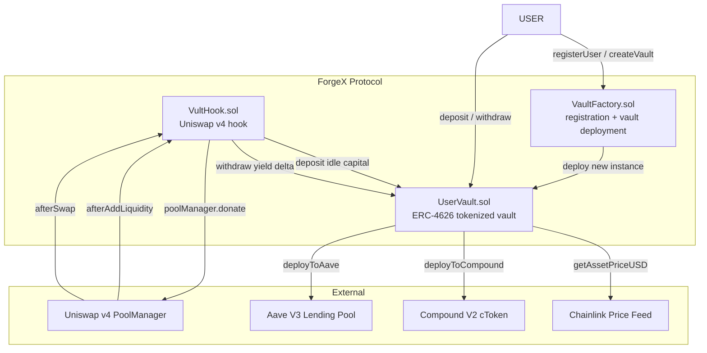
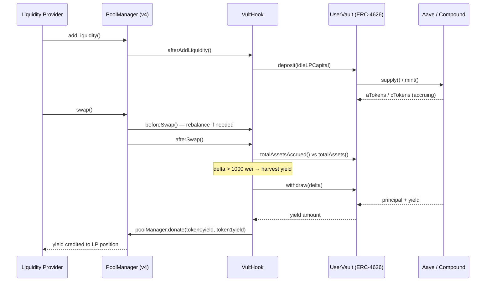

# ForgeX: Vult — Smart Contracts

<div align="center">

[](https://soliditylang.org)
[](https://hardhat.org)
[](https://book.getfoundry.sh)
[](https://basescan.org)
[](https://github.com/Uniswap/v4-core)
[](https://eips.ethereum.org/EIPS/eip-4626)

Solidity smart contracts for the ForgeX yield-native DeFi protocol. Deployed on Base Mainnet. Built with Hardhat (TypeScript tests) + Foundry (Solidity tests) for dual test coverage.

**[VaultFactory on BaseScan](https://basescan.org/address/0x8374257da04F00ABAf74E13EFE5A17B0f08EC226) · [VultHook on BaseScan](https://basescan.org/address/0xe988b6816d94C10377779F08f2ab08925cE96D09) · [Uniswap v4-core](https://github.com/Uniswap/v4-core)**

</div>

---

## Deployed Contracts — Base Mainnet

| Contract | Address | BaseScan |
|----------|---------|----------|
| **VaultFactory** | `0x8374257da04F00ABAf74E13EFE5A17B0f08EC226` | [View](https://basescan.org/address/0x8374257da04F00ABAf74E13EFE5A17B0f08EC226) |
| **VultHook** | `0xe988b6816d94C10377779F08f2ab08925cE96D09` | [View](https://basescan.org/address/0xe988b6816d94C10377779F08f2ab08925cE96D09) |
| **Base PoolManager** | `0x498581Ff718922c3f8e6A2444956aF099B2652b2` | [View](https://basescan.org/address/0x498581Ff718922c3f8e6A2444956aF099B2652b2) |

---

## Architecture



---

## VultHook — How Yield Harvesting Works

VultHook is the core innovation. It is a Uniswap v4 hook that operates entirely automatically at the pool level.



### Active Hook Flags

| Flag | Status | Purpose |
|------|--------|---------|
| `beforeInitialize` | ✗ | — |
| `afterInitialize` | ✗ | — |
| `beforeAddLiquidity` | ✗ | — |
| **`afterAddLiquidity`** | **✓** | Deposits idle LP capital into vaults |
| `beforeRemoveLiquidity` | ✗ | — |
| `afterRemoveLiquidity` | ✗ | — |
| **`beforeSwap`** | **✓** | Ensures sufficient liquidity for the swap |
| **`afterSwap`** | **✓** | Harvests yield delta → donates to LPs |

---

## Contract Reference

### VaultFactory.sol

Central registry. Manages user registration and vault deployment. One factory, many vaults.

**Key Functions:**

| Function | Visibility | Description |
|----------|-----------|-------------|
| `registerUser(username, bio)` | external | Register an on-chain user profile |
| `createVault(asset, name, symbol)` | external | Deploy a new `UserVault` for the caller |
| `getUserVaults(user)` | view | Returns `address[]` of all vaults for a user |
| `getUserInfo(user)` | view | Returns `username, bio, registeredAt` |
| `isUserRegistered(user)` | view | Returns `bool` registration status |
| `addAdmin(address)` | onlyOwner | Grant admin role |
| `removeAdmin(address)` | onlyOwner | Revoke admin role |

**Events:**
```solidity
event VaultCreated(address indexed owner, address indexed vault, address indexed asset, uint256 timestamp);
event UserRegistered(address indexed user, string username, uint256 timestamp);
```

---

### UserVault.sol — ERC-4626 Tokenized Vault

Each user gets their own `UserVault` instance. Fully ERC-4626 compliant with multi-protocol yield allocation and Chainlink USD valuations.

**ERC-4626 Core:**

| Function | Description |
|----------|-------------|
| `deposit(assets, receiver)` | Deposit assets, receive proportional shares |
| `withdraw(assets, receiver, owner)` | Withdraw assets, burn shares |
| `mint(shares, receiver)` | Mint exact share count |
| `redeem(shares, receiver, owner)` | Redeem shares for assets |
| `totalAssets()` | Total assets under management |
| `convertToShares(assets)` | Preview share count for asset amount |
| `convertToAssets(shares)` | Preview asset amount for share count |
| `previewDeposit/Withdraw/Mint/Redeem` | EIP-4626 preview functions |

**Protocol Allocation:**

| Function | Description |
|----------|-------------|
| `deployToAave(amount)` | Supply assets to Aave V3 lending pool |
| `deployToCompound(amount)` | Mint Compound cTokens |
| `withdrawFromAave(amount)` | Redeem from Aave |
| `withdrawFromCompound(amount)` | Redeem cTokens from Compound |
| `getAaveBalance()` | Assets currently in Aave |
| `getCompoundBalance()` | Assets currently in Compound |
| `totalAssetsAccrued()` | Total assets including all accrued interest |

**Chainlink USD Valuations:**

| Function | Description |
|----------|-------------|
| `getTotalValueUSD()` | Total vault value in USD (18 decimals) |
| `getSharePriceUSD()` | Per-share price in USD |
| `getAssetPriceUSD()` | Underlying asset spot price in USD |

**Chainlink Automation:**

| Function | Description |
|----------|-------------|
| `checkUpkeep(bytes calldata)` | Returns `(bool upkeepNeeded, bytes memory)` — view, safe to call off-chain |
| `performUpkeep(bytes calldata)` | Executes automated yield rebalancing |

**Admin:**

| Function | Description |
|----------|-------------|
| `pause()` / `unpause()` | Emergency circuit breaker |
| `transferOwnership(newOwner)` | Governance — standard Ownable |
| `owner()` | Returns current vault owner |

---

### VultHook.sol — Uniswap v4 Hook

Integrates with Uniswap v4's hook architecture. Deployed at an address with the correct leading bits to activate the three hook flags.

**References:** [Uniswap v4-core](https://github.com/Uniswap/v4-core) · [Hook Docs](https://docs.uniswap.org/contracts/v4/overview)

**Key Functions:**

| Function | Called By | Description |
|----------|-----------|-------------|
| `afterAddLiquidity(...)` | PoolManager | Deposits idle LP capital to ForgeX vaults |
| `beforeSwap(...)` | PoolManager | Ensures adequate liquidity for the swap |
| `afterSwap(...)` | PoolManager | Harvests yield delta, calls `poolManager.donate()` |
| `getHookPermissions()` | PoolManager | Returns active hook flags bitmask |

**Constructor Parameters:**
- `IPoolManager _poolManager` — Uniswap v4 PoolManager (`0x498581Ff718922c3f8e6A2444956aF099B2652b2`)
- `IUserVault _vault` — ForgeX vault to route liquidity through

---

## Project Structure

```
smartcontract/
├── contracts/
│   ├── VaultFactory.sol              # User registration + vault factory
│   ├── UserVault.sol                 # ERC-4626 vault + Aave + Compound + Chainlink
│   ├── vult/
│   │   └── VultHook.sol              # Uniswap v4 yield harvesting hook
│   ├── interfaces/
│   │   ├── IERC4626.sol              # ERC-4626 standard interface
│   │   ├── IUserVault.sol            # ForgeX vault interface (used by VultHook)
│   │   ├── IPool.sol                 # Aave V3 IPool
│   │   ├── IAToken.sol               # Aave aToken interface
│   │   └── ICToken.sol               # Compound cToken interface
│   └── mocks/                        # Test doubles (MockPoolManager, MockUserVault,
│                                     #   SimpleERC20, v4 types/interfaces/libraries)
├── test/
│   ├── UserVault.test.ts             # ~40 unit + integration tests
│   ├── VaultFactory.test.ts          # Registration + vault creation + admin roles
│   ├── UserVault2.test.ts            # Extended vault edge cases
│   ├── IERC4626.test.ts              # ERC-4626 compliance suite
│   ├── VultHook.test.ts              # Hook integration tests
│   └── foundry/
│       └── VultHook.t.sol            # Forge tests (Solidity)
├── scripts/
│   └── deploy.ts                     # Hardhat deployment scripts
├── hardhat.config.ts
├── foundry.toml
└── package.json
```

---

## Quick Start

### Hardhat (Primary)

```bash
cd smartcontract
npm install

# Compile
npx hardhat compile

# Run all tests
npx hardhat test

# Run specific test file
npx hardhat test test/UserVault.test.ts

# Gas report
REPORT_GAS=true npx hardhat test

# Coverage
npx hardhat coverage

# Deploy to Base Mainnet
npx hardhat run scripts/deploy.ts --network base
```

### Foundry (Secondary)

```bash
# Install Foundry dependencies
forge install

# Build
forge build

# Run Forge tests
forge test

# Verbose output
forge test -vvv

# Run specific test
forge test --match-test testVultHookAfterSwap -vvv
```

---

## Test Coverage

| Test File | Tests | Covers |
|-----------|-------|--------|
| `UserVault.test.ts` | ~40 | Deposit, withdraw, share math, protocol allocation, Chainlink feeds, pause/unpause, reentrancy |
| `VaultFactory.test.ts` | — | Registration, vault creation, admin role management |
| `UserVault2.test.ts` | — | Edge cases: zero amounts, max values, multi-user scenarios |
| `IERC4626.test.ts` | — | Full ERC-4626 compliance: previewDeposit, previewWithdraw, convertTo* |
| `VultHook.test.ts` | — | Hook lifecycle: afterAddLiquidity, beforeSwap, afterSwap, donate |
| `foundry/VultHook.t.sol` | — | Forge-native Solidity tests for hook integration |

---

## Security

- **OpenZeppelin v5** base contracts: `Ownable`, `ReentrancyGuard`, `Pausable`
- **ReentrancyGuard** on all state-changing vault functions (`deposit`, `withdraw`, `deployToAave`, etc.)
- **Chainlink** price feeds for manipulation-resistant USD values (no TWAP manipulation vector)
- **Pause mechanism** for emergency stops — owner can freeze all vault operations
- **Admin role separation** — vault owner vs. registered admins vs. factory owner
- **ERC-4626 share math** reviewed for virtual shares inflation attack protection
- **Hook address validation** — VultHook address must have correct prefix bits for flag activation

> **Audit Status:** Contracts are deployed to Base Mainnet but have **not** undergone a formal third-party security audit. Built on audited base contracts (OpenZeppelin v5, Uniswap v4-core). Use at your own risk.

---

## Environment Variables

Create `smartcontract/.env` (never commit):

```env
PRIVATE_KEY=your_deployer_private_key
BASE_RPC_URL=https://mainnet.base.org
BASE_SEPOLIA_RPC_URL=https://sepolia.base.org
ETHERSCAN_API_KEY=your_basescan_api_key
ALCHEMY_API_KEY=your_alchemy_api_key
```

---

## Network Configuration

| Network | Chain ID | RPC | Explorer |
|---------|----------|-----|----------|
| Base Mainnet | 8453 | `https://mainnet.base.org` | [basescan.org](https://basescan.org) |
| Base Sepolia | 84532 | `https://sepolia.base.org` | [sepolia.basescan.org](https://sepolia.basescan.org) |

---

## Dependencies

| Dependency | Purpose |
|-----------|---------|
| `@openzeppelin/contracts` v5 | Ownable, ReentrancyGuard, Pausable, ERC20 |
| `@uniswap/v4-core` | IHooks, PoolKey, BalanceDelta, IPoolManager |
| `@uniswap/v4-periphery` | BaseHook |
| `@chainlink/contracts` | AggregatorV3Interface |
| Aave V3 interfaces | IPool, IAToken |
| Compound V2 interfaces | ICToken |

---

## License

MIT License
